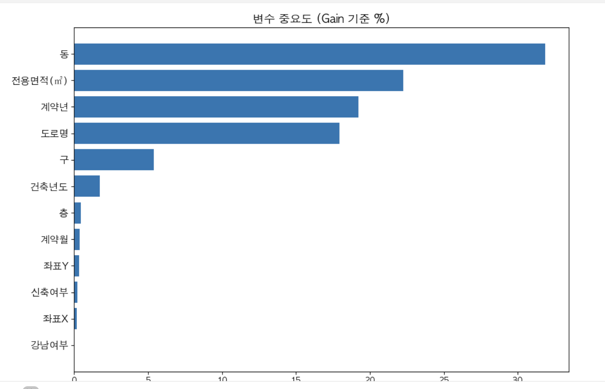

[](https://classroom.github.com/a/UBFhwOwS)

# \[Upstage-AI22-ML-2조\] 아파트 실거래가 예측

## Team

|  |  |  |  |
| :------------------------------------------------------------------------------------------: | :-------------------------------------------------------------: | :-------------------------------------------------------------: | :-------------------------------------------------------------: |
|                          [곽은주](https://github.com/UpstageAILab)                           |            [김원재](https://github.com/UpstageAILab)            |            [왕시훈](https://github.com/UpstageAILab)            |            [전호열](https://github.com/UpstageAILab)            |
|                                        대회 코드 작성                                        |      외부 데이터 수집<br/>발표자료 작성<br/>대회 코드 작성      |  발표 자료 작성<br/>대회 코드 작성<br/>**_\*public RMSE 1위_**  |     코드 저장소 관리<br/>환경 세팅 지원<br/>대회 코드 작성      |

## 0. Overview

본 프로젝트는 AI Stages – 아파트 실거래가 예측(House Price Prediction) 경진대회에 참여한
`Upstate AI 22기 ML 2조`의 협업 저장소입니다.

대규모 정형 데이터 기반 회귀 문제를 대상으로 하며,
EDA → 전처리 → 피처 엔지니어링 → 모델링 → 제출까지의 전 과정을 재현 가능하고 일관된 개발 환경에서 수행하는 것을 목표로 합니다.

특히 본 저장소는 다음 원칙을 따릅니다.

- 팀원 전원이 동일한 Python / 패키지 버전 사용

- 실험 코드와 개인 작업을 **공통 패키지 구조**(`lab_core`)로 통합

- `.vscode` + `uv` 기반 워크스페이스 단일화

- 파생 데이터(`data/`)와 결과물(`outputs/`)은 비버전 관리(.gitignore)

### Key Highlights (발표 기준)

- 좌표 결측 약 87만 건 → Kakao API 기반 보완(커버리지 98% 이상)
- 베이스라인 RMSE 47,133.7121 → 최종 RMSE 14,973(약 68.2% 개선)
- 시계열 분할 기반 검증 적용(Train/Valid/Test 기간 분리)

### Environment

#### Development Environment

- Python: `3.10.13` (필수 고정)

- 패키지 관리: `uv`

- IDE / Editor: VS Code (권장)

- Notebook: Jupyter / ipykernel

- OS: Windows / macOS / Linux (공통 지원)

모든 팀원은 동일한 개발 환경을 사용하며,
환경 차이로 인한 실험 결과 편차를 최소화합니다.

#### Workspace Convention

본 프로젝트는 아래 요소들을 모든 팀원이 공통으로 사용하는 것을 전제로 합니다.

- `.vscode/settings.json`
  - Python 인터프리터 고정 (`.venv`)

  - `.env` 기반 환경 변수 로딩

  - CSV / Notebook / Formatter 통합 설정

- `uv.lock`
  - 의존성 완전 고정 (requirements.txt 대체)

- `bootstrap.sh`
  - 환경 초기 세팅 및 업데이트 자동화 스크립트

  ```bash
  # 최초 설치 또는 업데이트 시
  bash bootstrap.sh
  ```

  > `git pull` 이후에도 항상 `bootstrap.sh` 실행을 권장합니다.

### Requirements

#### Runtime Dependencies

모델 학습 및 추론에 사용되는 주요 라이브러리입니다.

```
eli5==0.13.0
matplotlib==3.7.1
numpy==1.23.5
pandas==1.5.3
lightgbm==4.2.0
scikit-learn==1.2.2
scipy==1.11.3
seaborn==0.12.2
statsmodels==0.14.0
tqdm==4.66.1
```

#### Development Dependencies

EDA 및 실험 환경을 위한 개발 의존성입니다.

```
ipykernel==6.27.1
jupyter==1.0.0
```

> ⚠️ 패키지 버전 임의 변경 금지
> 팀 실험 재현성과 제출 검증을 위해 모든 의존성은 `uv.lock` 기준으로 고정됩니다.

## 1. Competiton Info

### Overview

- 대회명: 아파트 실거래가 예측 (House Price Prediction)

- 주최: AI Stages

- 문제 유형: Regression

- 목표: 서울시 아파트 매매 실거래가 예측

- 평가지표: RMSE (Root Mean Squared Error)

### Timeline

- January 06, 2026 - Start Date
- January 12, 2026 - Final submission deadline

## 2. Components

### Directory

```
├─ data/
│  ├─ raw/        # 대회 제공 학습/테스트 데이터 (*.csv)
│  ├─ ext/        # 허용된 외부 공공/부가 데이터 (*.csv)
│  └─ cache/      # 디스크 캐시
│
├─ docs/          # 팀 공유 문서 (*.md, *.pdf, *.ppt)
│
├─ notebooks/     # 노트북 파일
│  ├─ ejk/        # 개인 노트 (팀원 이니셜로 구분)
│  ├─ hyj/
│  ├─ shw/
│  └─ wjk/
│
├─ outputs/       # 학습 모델, 제출 csv 등
│
├─ script/        # CLI 스크립트 (*.py, *.sh)
│
├─ src/
│  └─ lab_core/   # 파이썬 패키지
│     ├─ ejk/     # 개인 모듈 (팀원 이니셜로 구분)
│     ├─ hyj/
│     ├─ shw/
│     ├─ wjk/
│     ├─ styles/  # 공용 시각화 보조 도구 패키지
│     └─ util/    # 공용 유틸 패키지
│
├─ .vscode/       # VSCode 팀 워크스페이스 설정
├─ bootstrap.sh   # 환경 초기 세팅 및 업데이트 자동화 스크립트
├─ pyproject.toml # 파이썬 프로젝트 설정 (의존성 명세 등)
├─ uv.lock
└─ README.md
```

## 3. Data descrption

### Dataset overview

- 대회 제공: 서울 아파트 실거래 데이터(학습/테스트), 지하철·버스 접근성 데이터
- 외부 활용: Kakao API 좌표 보완 데이터, 서울시 공공주택(k-apt) 아파트 정보
- 목표: 서울시 아파트 매매 실거래가 예측(RMSE)
- 좌표 결측 보완을 위해 시군구/도로명 기반 주소를 사용해 외부 좌표를 생성
- 데이터 규모: train 111만 x 52, test 9,272 x 51
- 데이터 날짜 범위: train(2007.01 ~ 2023.06), test(2023.07 ~ 2023.09)

### EDA

- 데이터 규모 및 변수 분포 확인 후, 전처리 우선순위 결정
- 결측 및 이상치 분포를 점검하고 도메인 해석상 유효한 범위는 유지
- 주소/좌표/시간 변수의 영향이 크다는 점을 확인하고 파생 변수 설계에 반영
- 좌표 결측이 많은 구간을 확인하고, 주소 기반 보완 전략을 수립

### Data Processing

- 좌표 보정: 시군구/도로명 정보와 Kakao API 좌표를 활용해 위경도 결측 보완
- 결측 처리: 학습에 부적합한 변수는 제외, 동일 기준으로 테스트에도 적용
- 이상치 처리: 전용면적/층/건축년도 등 핵심 변수는 도메인 특성상 제거하지 않음
- 범주형 정리: 구/동 분리, 강남권 여부 등 지역 파생 변수 생성
- 시간 파생: 계약년월 → 계약년도/계약월로 분해
- 좌표 보정 세부: 시군구+도로명(또는 번지 조합) 기준으로 보완, 중복 주소 단위로 좌표 생성

## 4. Modeling

### Model descrition

- LightGBM을 주요 모델로 사용(범주형 처리 및 성능 우수)
- RandomForest 등과 비교해 최종 성능이 안정적인 모델을 선택
- 하이퍼파라미터 조합을 반복 실험하여 최적 모델을 탐색

### Modeling Process

- 시계열 특성을 고려해 계약년월 기준으로 Train/Validation 분할
  - 발표 기준: Train( ~ 2022.06), Valid (2022.07 ~ 2023.06)
- LightGBM 하이퍼파라미터 조합을 반복 실험하여 성능 비교
- 최종 모델은 Train+Validation을 합쳐 재학습 후 Test 예측
- Feature Importance를 통해 주요 변수 기여도를 확인

## 5. Result

### Leader Board

- Public RMSE: 14973.0670
- Private RMSE: 11847.0515


### Presentation

- 발표 자료: [아파트 실거래가 예측 경진대회 발표 자료](https://docs.google.com/presentation/d/1HNOPJU31c8MF5IExVmSmKNq-aIr2oYIGQbroRHYbemE/edit?usp=sharing)
- 좋은 평가를 받은 노트북들 (RMSE: 예측 오차 지표, 낮을수록 좋음):
  - [RMSE 14,973](notebooks/shw/CodeFinal.ipynb)
  - [RMSE 17,725](notebooks/wjk/house_price_prediction_17725.ipynb)

### Interpretation

- Validation 성능이 높은 모델이 항상 Test에서 최고 성능을 보장하지는 않음을 확인
- 상대적으로 단순한 구조의 모델이 일반화 성능에서 안정적인 결과를 보였음
- 변수 중요도 상위: 동, 전용면적, 계약년, 도로명, 구 (상위 5개가 약 96% 기여)



## etc

### Meeting Log

- 주요 의사결정과 정보 공유는 팀 커뮤니케이션 채널을 통해 진행했습니다.

### Reference

- 참고한 외부 공공 데이터: [서울시 공공주택 아파트 정보](https://data.seoul.go.kr/dataList/OA-15818/S/1/datasetView.do)
- 주소 기반 좌표 보완 API: [Kakao Local API - 주소 검색](https://dapi.kakao.com/v2/local/search/address.json)
